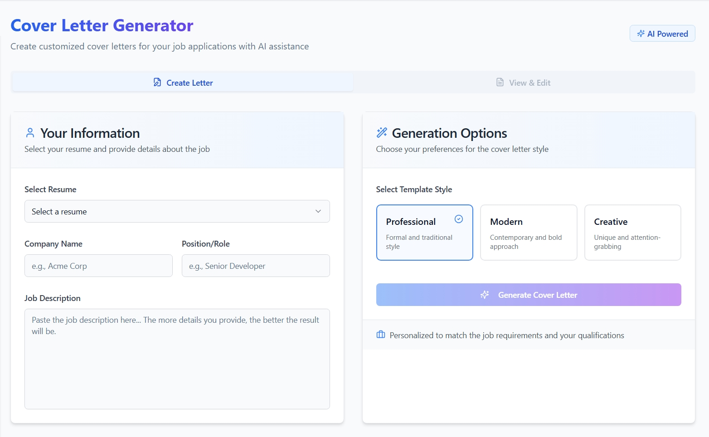

# AI Career Forge 🚀

<p align="center">
  <a href="https://ai-career-forge.vercel.app" target="_blank">
    
  </a>
</p>


AI Career Forge is a web application designed to assist users in optimizing their resumes and matching them with suitable job descriptions using AI.

## Table of Contents
- [Screenshots](#screenshots-)
- [Features](#features)
- [Technologies Used](#technologies-used)
- [Project Structure](#project-structure)
- [Models and Database](#models-and-database)
- [User Workflow](#user-workflow)
- [API Endpoints Overview](#api-endpoints-overview)
- [Getting Started](#getting-started)
- [Installation](#installation)
- [Running the Project](#running-the-project)
- [Building for Production](#building-for-production)
- [Contributing](#contributing)
- [License](#license)
- [Contact](#contact)

## Screenshots 📸
Here's a visual tour of AI Career Forge:

| Screenshot 1 | Screenshot 2 |
|--------------|--------------|
|  |  |
| *Hero Section* | *Home Page* |

| Screenshot 3 | Screenshot 4 |
|--------------|--------------|
|  |  |
| *Resume Analysis* | *Resume Builder* |

| Screenshot 5 | Screenshot 6 |
|--------------|--------------|
|  |  |
| *Job Matching* | *Cover Letter Generation* |

| Screenshot 7 | Screenshot 8 |
|--------------|--------------|
|  |  |
| *Cover Letter Result* | *Help & Tips* |

| Screenshot 9 | Screenshot 10 |
|--------------|--------------|
|  |  |
| *Used Documents* | *Dashboard* |

## Features ✨
*   **User Authentication:** Secure signup and login functionality using Firebase Authentication.
*   **Resume Upload & Parsing:** Users can upload resumes in PDF or DOCX format.
*   **AI Resume Analysis:** Provides feedback and scoring on uploaded resumes using AI (Google Generative AI).
*   **AI Resume Builder:** Helps users generate professional resumes based on provided information.
*   **Job Matching:** Compares user resumes (uploaded or generated) against job descriptions to assess suitability.
*   **Resume Tips:** Offers general advice and best practices for resume writing.
*   **User Dashboard:** A central place for authenticated users to manage their resumes, generate cover letters, and access features.

## Technologies Used 🛠️
**Frontend:**

*   **Framework/Library:** React
*   **Build Tool:** Vite
*   **Language:** TypeScript
*   **UI Components:** shadcn/ui
*   **Styling:** Tailwind CSS
*   **Routing:** React Router DOM
*   **State Management/Data Fetching:** TanStack Query (React Query)
*   **API Client:** Axios
*   **Authentication:** Firebase Client SDK

**Backend:**

*   **Framework:** Express.js
*   **Language:** TypeScript
*   **Runtime:** Node.js
*   **Authentication:** Firebase Admin SDK (for token verification)
*   **AI:** Google Generative AI SDK (`@google/generative-ai`)
*   **Database:** Firebase Firestore (for storing user data, resume metadata, generated content, etc.)
*   **File Handling:** Multer (uploads), Mammoth (docx parsing), pdf-parse (pdf parsing)
*   **API Testing:** Jest, Supertest (setup, actual tests might be pending)

## Project Structure 🗂️
The project is organized into two main parts:

*   `frontend` (root directory): Contains the React application built with Vite.
    *   `src/`: Main source code.
        *   `components/`: Reusable UI components (including shadcn/ui).
        *   `pages/`: Top-level page components for different routes.
        *   `lib/`: Core utilities like API client (`api.ts`), Firebase setup (`firebase.ts`).
        *   `context/`: React context providers (e.g., `AuthContext.tsx`).
        *   `App.tsx`: Main application component defining routes.
        *   `main.tsx`: Application entry point.
*   `backend/`: Contains the Node.js/Express API server.
    *   `src/`: Main source code.
        *   `controllers/`: Request handlers containing business logic.
        *   `routes/`: Defines API endpoints and maps them to controllers.
        *   `middleware/`: Custom middleware (e.g., `auth.middleware.ts` for token verification).
        *   `config/`: Configuration files (e.g., `multer.config.ts`, Firebase Admin setup).
        *   `models/`: Contains data models/schemas (e.g., for User, Resume, JobMatchResult) likely interacting with the database.
        *   `server.ts`: Express application setup and entry point.

## Models and Database 📈
*   **Models:** The `backend/src/models/` directory likely defines the structure of data used in the application, such as User profiles, Resume details (metadata, parsed content, analysis results), and potentially Job descriptions or Match results. These models interface with the database.
*   **Database:** Firebase Firestore is used as the NoSQL database. It stores user account information, links to uploaded resumes (stored possibly in Firebase Storage or locally), parsed resume content, analysis scores, generated resume data, and job matching results.

## User Workflow 📊
A typical user interaction with AI Career Forge follows these steps:

1.  **Authentication:**
    *   New users sign up for an account.
    *   Existing users log in.
2.  **Resume Management (Choose one or more):
    *   **Upload & Analyze:** Upload an existing resume (PDF/DOCX). The system parses it and provides AI-driven analysis and scoring.
    *   **Build:** Use the Resume Builder feature to create a new resume from scratch or based on provided information.
3.  **Job Matching:**
    *   Provide a job description.
    *   Select an uploaded or generated resume.
    *   The system analyzes the match between the resume and the job description, providing insights.
4.  **Review & Refine:**
    *   Based on analysis and matching results, users can refine their resumes using the builder or by uploading revised versions.
    *   Access general resume tips for guidance.
5.  **(Optional) Cover Letter:** Generate cover letters (feature implied by dashboard structure).

## API Endpoints Overview 📚
The backend exposes RESTful API endpoints, primarily authenticated using Firebase ID tokens verified by the `auth.middleware.ts`.

Key route groups under `/api`:

*   `/auth`:
    *   `POST /signup`: User registration.
    *   `POST /login`: User login.
*   `/resumes` (Requires Authentication):
    *   `GET /`: Get list of uploaded resumes for the authenticated user.
    *   `POST /upload`: Upload a resume file (`resumeFile`) for parsing and storage.
    *   `POST /:resumeId/analyze`: Trigger AI analysis for a specific uploaded resume.
*   `/builder` (Requires Authentication):
    *   `GET /generated`: Get list of resumes generated by the builder for the user.
    *   `POST /generate`: Generate a new resume based on user input.
    *   `GET /download/:generatedResumeId`: Download a specific generated resume (likely as PDF).
*   `/match` (Requires Authentication):
    *   `POST /resume-job`: Compare a user's resume (by ID or potentially text) against a provided job description.
*   `/tips`:
    *   `GET /`: Fetch general resume writing tips.

*(Refer to `backend/src/routes/*.routes.ts` and corresponding controllers in `backend/src/controllers/` for detailed request/response structures and logic.)*

## Getting Started 🚀
### Prerequisites

*   Node.js and npm (or yarn/pnpm/bun)
*   Firebase Project: Set up a Firebase project for Authentication and Firestore.
*   Google Cloud Project: Set up a project for Google Generative AI and enable the API.
*   Environment Variables: Create `.env` files in both the root (frontend) and `backend` directories.

### Environment Variables

**Root Directory (Frontend - `.env`):**

```
VITE_FIREBASE_API_KEY="your_firebase_api_key"
VITE_FIREBASE_AUTH_DOMAIN="your_firebase_auth_domain"
VITE_FIREBASE_PROJECT_ID="your_firebase_project_id"
VITE_FIREBASE_STORAGE_BUCKET="your_firebase_storage_bucket"
VITE_FIREBASE_MESSAGING_SENDER_ID="your_firebase_messaging_sender_id"
VITE_FIREBASE_APP_ID="your_firebase_app_id"
VITE_FIREBASE_MEASUREMENT_ID="your_firebase_measurement_id_optional"

VITE_BACKEND_API_URL="http://localhost:3000/api" # Or your deployed backend URL
```

**Backend Directory (`backend/.env`):**

```
PORT=3000

# Firebase Admin SDK Configuration (Service Account Key)
# Option 1: Path to service account JSON file
# FIREBASE_SERVICE_ACCOUNT_PATH="path/to/your/serviceAccountKey.json"
# Option 2: Base64 encoded service account JSON string (preferred for some environments)
# FIREBASE_SERVICE_ACCOUNT_BASE64="your_base64_encoded_service_account_json"
# If using Option 2, ensure your backend code can decode this.
# You'll need to choose one method and ensure the backend Firebase initialization uses it.
# For simplicity, if you place the serviceAccountKey.json in the backend/src/config folder,
# you might not need a specific path variable if the code directly references it.
# However, using an env var for the path or the content is more flexible.

# Google Generative AI API Key
GOOGLE_API_KEY="your_google_generative_ai_api_key"

# CORS Origin (Frontend URL)
CORS_ORIGIN="http://localhost:5173" # Or your deployed frontend URL
```

## Installation 🛠️
1.  **Clone the repository:**
    ```bash
    git clone https://github.com/sushil930/ai-career-forge.git
    cd ai-career-forge
    ```

2.  **Install Frontend Dependencies:**
    ```bash
    npm install
    # or yarn install, pnpm install, bun install
    ```

3.  **Install Backend Dependencies:**
    ```bash
    cd backend
    npm install
    # or yarn install, pnpm install, bun install
    cd ..
    ```

## Running the Project 🚀
1.  **Start the Backend Server:**
    Open a terminal in the `backend` directory:
    ```bash
    cd backend
    npm run dev
    # or yarn dev, pnpm dev, bun dev
    ```
    The backend server will typically start on `http://localhost:3000` (or the port specified in `backend/.env`).

2.  **Start the Frontend Development Server:**
    Open another terminal in the root project directory:
    ```bash
    npm run dev
    # or yarn dev, pnpm dev, bun dev
    ```
    The frontend development server will typically start on `http://localhost:5173`.

3.  Open your browser and navigate to `http://localhost:5173`.

## Building for Production 📦
**Frontend:**

From the root directory:
```bash
npm run build
```
This will create a `dist` folder with the production-ready static assets.

**Backend:**

From the `backend` directory:
```bash
npm run build
```
This will compile TypeScript to JavaScript, typically in a `dist` or `build` folder within the `backend` directory. You can then run the compiled code using `node dist/server.js` (or similar).

## Contributing 🤝
Contributions are welcome! If you'd like to contribute, please follow these steps:

1.  Fork the repository.
2.  Create a new branch (`git checkout -b feature/your-feature-name`).
3.  Make your changes and commit them (`git commit -m 'Add some feature'`).
4.  Push to the branch (`git push origin feature/your-feature-name`).
5.  Open a Pull Request.

Please ensure your code adheres to the existing style and that any new features are well-tested.

## License 📄
This project is licensed under the MIT License. See the `LICENSE` file for details (if one is created, otherwise assume MIT).

## Contact 📧
For questions or support, please reach out to [sushilpatel5113@gmail.com](mailto:sushilpatel5113@gmail.com).

---

Made with ❤️ by @sushil930.
